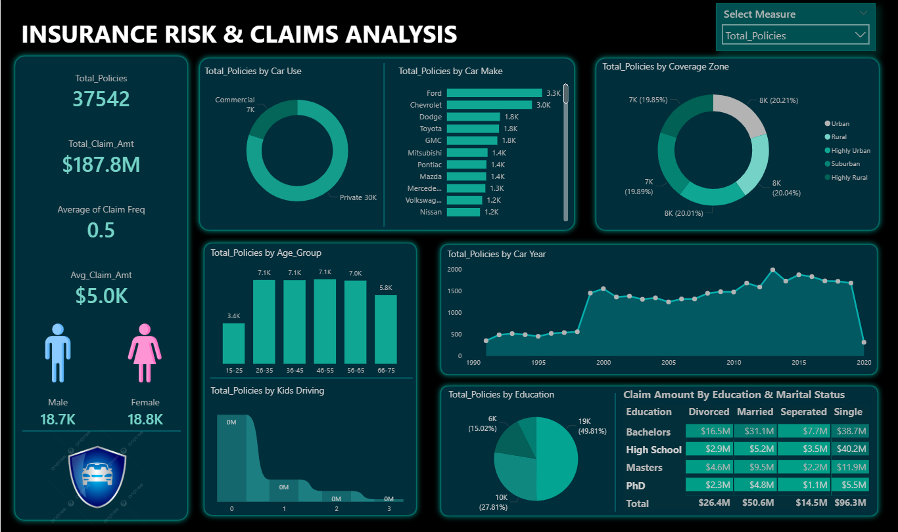

# 📊 Insurance Risk & Claims Analysis – Power BI Dashboard

## 📌 Project Overview
This project presents an Insurance Risk & Claims Analysis dashboard built in Power BI. It analyzes insurance policy distribution, claim behavior, and demographic patterns to identify potential risk segments.

The dashboard provides insights into how factors such as vehicle usage, age group, education level, coverage zone, and marital status influence insurance policies and claim amounts.

---

## 🎯 Business Objective
The objective of this dashboard is to help insurance companies:

- Identify high-risk customer segments
- Monitor claim trends
- Analyze policy distribution across demographics
- Support data-driven decision making

---

## 📊 Key KPIs

- Total Policies: **37,542**
- Total Claim Amount: **$187.8M**
- Average Claim Frequency: **0.5**
- Average Claim Amount: **$5.0K**

---

## 🛠 Tools & Technologies

- Power BI
- DAX (Data Analysis Expressions)
- Power Query
- Data Modeling
- Interactive Visualizations

---

## 📷 Dashboard Preview

---

## 📂 Project Files

- INSURANCE RISK & CLAIMS ANALYSIS.pbix – Power BI Dashboard
- Pic.png – Dashboard Screenshot

---

## 📚 Learning Source
This project was created as part of my Power BI learning journey and was inspired by a YouTube tutorial. I recreated the dashboard to practice concepts such as data cleaning, DAX measures, KPIs, and dashboard design.
